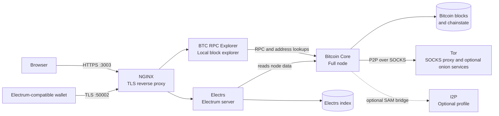

<div align="center">
  <h1>Bitcoin full node with Docker</h1>

  

  <p>
    <strong>Self-host a privacy-focused Bitcoin full node with local Docker builds.</strong>
  </p>

  <p>
    <a href="https://github.com/reverse-hash/bitcoin-full-node-with-docker/actions/workflows/build.yml">
      </a> 
    <a href="./LICENSE.txt"></a>
  </p>

  <strong><a href="./GETTING_STARTED.md">Getting started</a></strong>
  | <strong><a href="./UPDATING_SERVICES.md">Updating services</a></strong>
  | <strong><a href="./FAQ.md">FAQ</a></strong>
  | <strong><a href="https://github.com/reverse-hash/bitcoin-full-node-with-docker/discussions">Support</a></strong>
</div>

## Overview

This project deploys a Docker Compose stack for running a self-hosted Bitcoin full node on your own hardware. It combines Bitcoin Core, Tor, Electrs, BTC RPC Explorer, NGINX and optional I2P so you can sync the blockchain, connect Electrum-compatible wallets on your LAN, browse your node locally and optionally expose selected services over Tor.

The stack is designed for users who want transparent local builds instead of pulling prebuilt images from a registry. Core services are built from upstream source code and the build process verifies signed tags or pins trusted source references where upstream signing is not available.

## What you get

| Service | Purpose | Version | Status |
| --- | --- | --- | --- |
| [Tor](https://gitlab.torproject.org/tpo/core/tor/) | Routes Bitcoin P2P traffic through Tor and can host optional onion services. | 0.4.9.8 |  |
| [Bitcoin Core](https://github.com/bitcoin/bitcoin) | Validates blocks and transactions as a full Bitcoin node. | 31.0 |  |
| [Electrs](https://github.com/romanz/electrs) | Serves Electrum-compatible wallets from your own node. | 0.11.1 |  |
| [BTC RPC Explorer](https://github.com/janoside/btc-rpc-explorer) | Provides a local Bitcoin blockchain explorer backed by your node. | 3.5.1 |  |
| [NGINX](https://github.com/nginxinc/docker-nginx) | Terminates local TLS for BTC RPC Explorer and Electrs. | stable-slim |  |
| [I2P](https://github.com/i2p/i2p.i2p) | Optional additional privacy network for advanced users. | 2.12.0 |  |

Version status badges are generated weekly. `current` means the pinned version matches the latest stable upstream tag; `new release` means a newer upstream tag is available for review.

## Quick start

Read [Getting started](./GETTING_STARTED.md) before running the stack. The first setup needs host volume permissions, RPC credentials and enough disk space for Bitcoin Core plus Electrs indexes.

```shell
cp .env.example .env
docker compose --env-file .env build
docker compose --env-file .env up -d tor
docker compose --env-file .env up -d bitcoin
```

After Bitcoin Core finishes initial block download, continue with Electrs, BTC RPC Explorer and NGINX as described in the setup guide.

## Architecture



Bitcoin Core is the source of truth for validation and chain state. Electrs builds an Electrum index from the Bitcoin Core data directory, and BTC RPC Explorer reads from Bitcoin Core RPC plus Electrs for address and transaction lookups.

NGINX is the only service intended to expose wallet and browser entry points on the host by default:

- `3003/tcp`: HTTPS access to BTC RPC Explorer.
- `50002/tcp`: TLS access for Electrum-compatible wallets.

Tor runs alongside Bitcoin Core so node P2P traffic can use the Tor SOCKS proxy. Optional onion services are configured in Tor and should be enabled deliberately. I2P is disabled by default through the Compose profile and is only built or started when the `disabled` profile is requested.

Persistent data lives under `volumes/` by default:

- `volumes/bitcoin`: Bitcoin Core blocks, chainstate and node configuration.
- `volumes/electrs`: Electrs index data.
- `volumes/btcrpcexplorer`: BTC RPC Explorer local configuration.
- `volumes/nginx`: TLS certificates and reverse proxy configuration.
- `volumes/tor` and `volumes/i2p`: privacy network state.

## Local builds and source verification

The project intentionally does not publish Docker Hub or GHCR images. Building locally keeps the deployment auditable and aligned with the goal of compiling the node stack from upstream sources.

Current verification model:

- Bitcoin Core: clones the official repository and verifies the release tag with Bitcoin Core builder keys.
- Tor: clones the Tor Project repository and verifies the release tag.
- Electrs: clones the official repository and verifies the release tag using the maintainer's SSH signing key.
- I2P: downloads the upstream source archive and verifies its detached signature.
- BTC RPC Explorer: pins the release tag to the expected commit because upstream release tag verification is not currently available.

## Requirements

Use a Linux host with Docker Compose, reliable bandwidth and storage sized for a non-pruned Bitcoin Core node plus Electrs data. Bitcoin.org currently lists 750 GB as the default disk requirement for Bitcoin Core and a one-time 740 GB initial download. This stack also stores Electrs indexes, so plan for more than Bitcoin Core alone and leave growth headroom.

## Version policy

Versions in `.env.example` are the versions tested by this repository. They are not automatically the latest upstream releases. When updating a component, rebuild it locally, verify the corresponding Dockerfile and open a focused pull request if the build process needs changes.

See [Updating services](./UPDATING_SERVICES.md) for the manual upgrade workflow.

## Documentation

- [Getting started](./GETTING_STARTED.md)
- [Updating services](./UPDATING_SERVICES.md)
- [FAQ](./FAQ.md)

## Special thanks

- Kudos to Emmanuel Rosa for an initial [list of nodes for Tor](https://github.com/emmanuelrosa/bitcoin-onion-nodes).
- Kudos to [cozybear-dev](https://github.com/cozybear-dev) for multi-arch Tor proxy work and documentation/security improvements.
